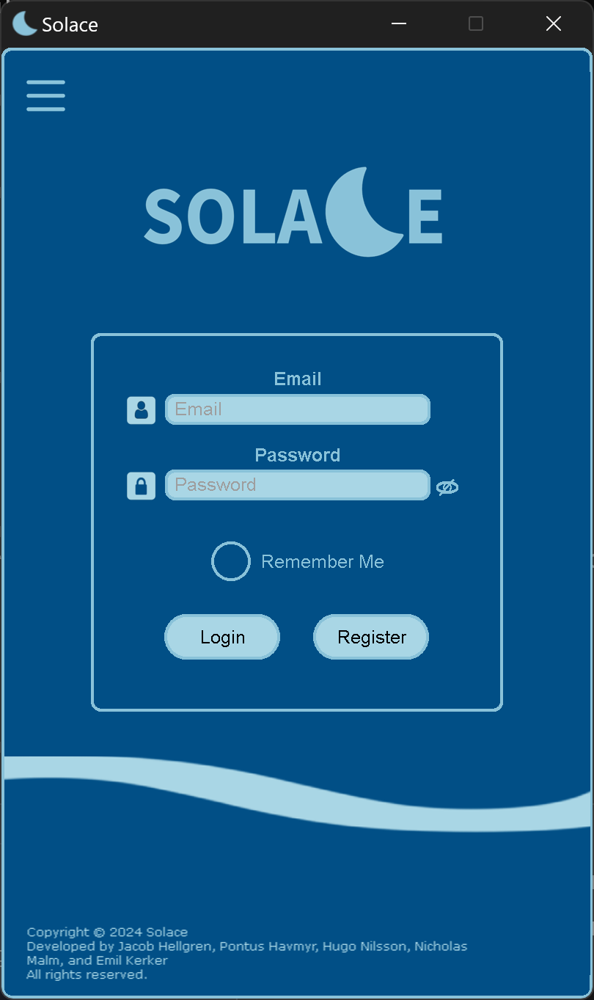
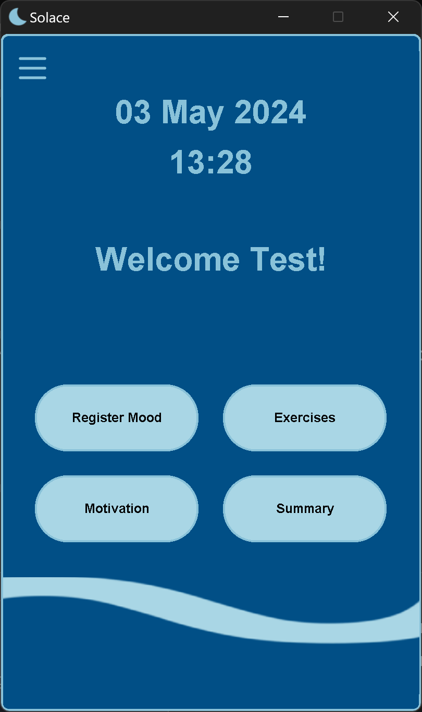
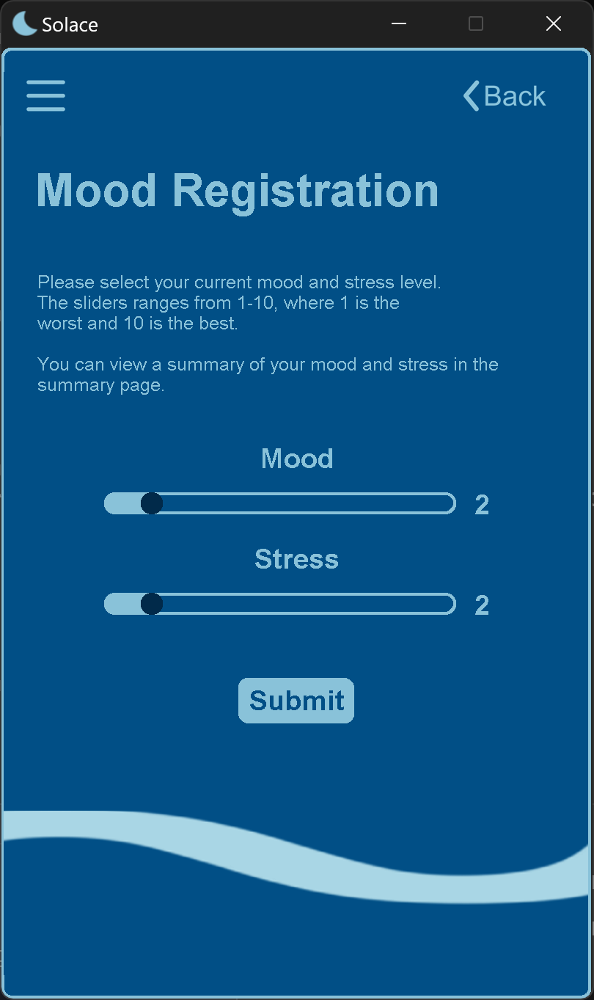

# Solace

This desktop application is designed to help people deal with stress and anxiety by allowing them to track their mood and stress levels during a period of time.


## Screenshots

  


## Installation

To run this application, you need to have Python installed on your machine. You can download Python from the official website: https://www.python.org/downloads/

You also have to install **Make** on your machine, to access the make commands. You can download make from the official website: https://www.gnu.org/software/make/

<span style="color: red;"><strong>NOTE:</strong></span> To be able to run the program, and access the database, you need to have the firebase credentials file. This file is not included in the repository, so you need to contact the developers to get the file.


After installing Python, you can run the following command to clone this repository to your machine, install the required dependencies and run the application:

**1.** Clone the repository:


```bash
git clone https://github.com/HugNil/Solace.git
```

---

**2.** Enable the virtual environment. This command is for git. You might need a slightly different command if you're using powershell. (optional):

```bash
make venv
```
then..

```bash
source venv/bin/activate
```

---

**3.** Install the required dependencies:

```bash
make install
```
.. or if you dont have make installed:
```bash
pip install -r requirements.txt
```

---

**4.** Navigate to the root directory which is the Solace folder. Use the following command if you are'nt already in the root directory:

```bash
cd Solace
```

---

**5.** Run the application:

```bash
python .\src\gui.py
```

---

## Application structure

This application is structured into several Python files, each serving a different purpose. Here are some of the files and their purposes:

- `collapsible_menu.py`: This file contains the collapsible menu class which is responsible for the collapsible menu of the application.
- `firebase_connection.py`: This file contains the connection to firebase, where user data is stored.
- `home_page.py`: This file contains the first page of the application, where the user can login or register.
- `profile_page.py`: This file contains the profile page of the application.
- `gui.py`: This file contains the main class of the application, which is responsible for the main window of the application.
- `props.py`: This file contains the props class which is responsible for theproperties of the application
- `mood_registration.py`: This file contains the mood registration page of the application.

## Changelog

To see the changes made to this application, check the [CHANGELOG.md](CHANGELOG) file.

## FAQ

**Q: I can't start the application from the command line. What should I do?**

**A:** Make sure you are in the root directory of the application when you run the command. You can navigate to the root directory by using the following command:

```bash
cd Solace
```
and then run the application using the following command:

```bash
python .\src\gui.py
```

---

**Q: I can't install the required dependencies. What should I do?**

**A:** Make sure you have Python installed on your machine. You can download Python from the official website: https://www.python.org/downloads/

You also have to install **Make** on your machine, to access the make commands. You can download make from the official website: https://www.gnu.org/software/make/

---

**Q: The application is telling me that I am missing the firebase credentials file. What should I do?**

**A:** To be able to run the program, and access the database, you need to have the firebase credentials file. This file is not included in the repository, so you need to contact the developers to get the file.

---

**Q: I have a question that is not answered here. What should I do?**

**A:** If you have any questions that are not answered here, feel free to open an issue on this repository. We will be happy to help you.

